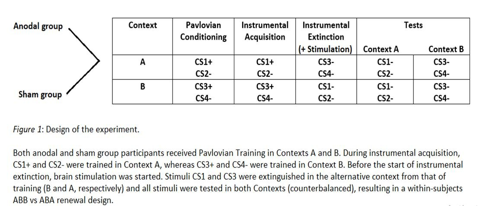
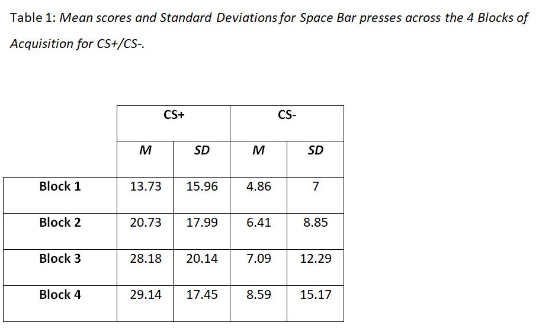
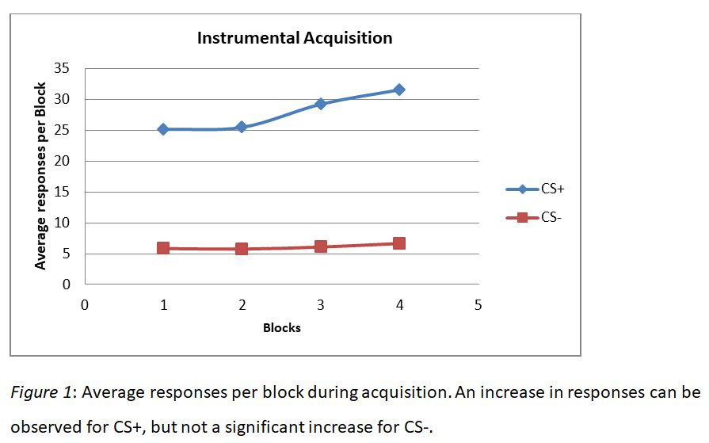
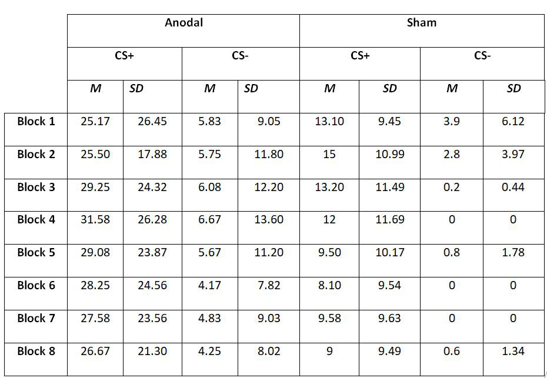
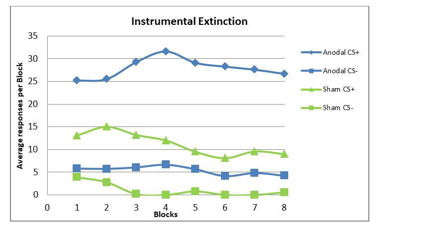
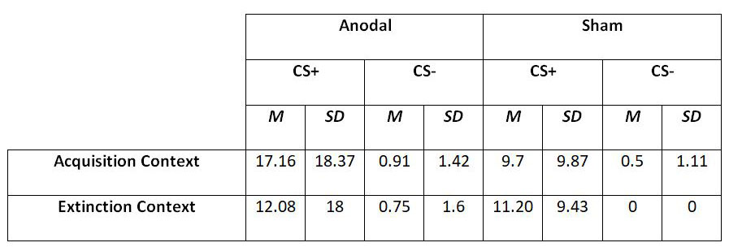
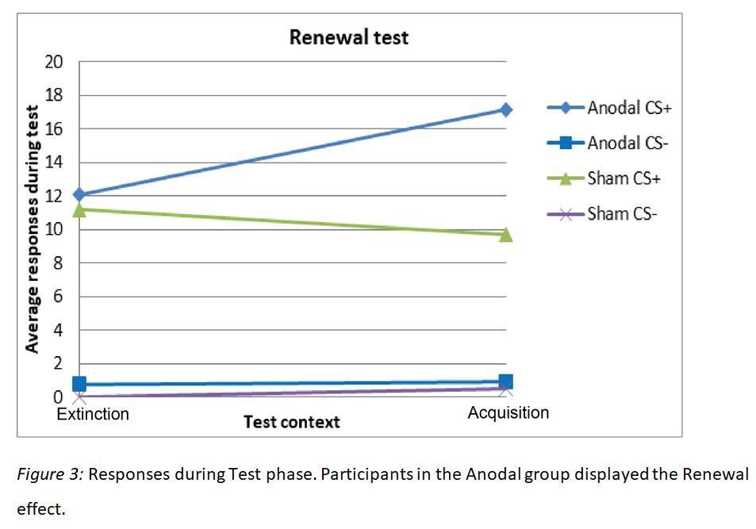

# Transcranial Direct Current Stimulation effect on renewal of instrumental avoidance in humans 
&nbsp;
## **INTRODUCTION**
We might acquire an unreasonable fear at some point in life and try at a later stage to get rid of it by doing exposure-based therapies, which aim to reduce the fear through gradual exposure to the stimulus (this a process called 'extinction'). This usually works when tested in the context of therapy (i.e. the room where the therapy happened), however, once the person steps into the real world, the fear most often reapers. This is called 'the renewal effect' and it happens because learning happens not only between a stimulus and a reaction but also while taking into account the context. Therefore, you would have to enhance the extinction process to overcome the renewal
effect. 
&nbsp;
In order to overcome this effect, you can use brain stimulation on dorsolateral prefrontal cortex in the hopes of enhancing the extinction process.
The current study used this method with a transcranial direct current stimulator over human participant's left forehead (All ethical permissions were received and can be shown upon request).
&nbsp;
The main hypotheses were:
1) Stimulation will facilitate a faster extinction learning compared to the no stimulation group
2) Stimulation will lead to an attenuated renewal of fear compared to the no stimulation group

&nbsp;
***
## **DESIGN**
Participants were split into 2 groups (Anodal and Sham), they all then had to go through the same 4 phases on the computer: Pavlovian (acquiring the fear response to a stimulus  by pairing 2 of the 4 stimuli to an adverse event i.e. loud noise coming from headphones), Instrumental acquisition (acquiring the escape response upon presentation of the previously conditioned stimulus i.e. being able to press space bar in order to stop the presentation of the adverse event), Instrumental Extinction (relearning that the stimulus is no longer to be feared i.e. participants still allowed to press space bar but no sound would be presented anyway for all stimuli) and Test phase (presentation of the stimuli again). The Pavlovian and Instrumental acquisition phases happened in the same context (given by the color of the background of the screen), while Extinction phase happened in a new context. During the Test phase, all stimuli were presented in both contexts.
&nbsp;

&nbsp;

Anodal group = group receivig stimulation,
Sham group = no stimulation group,
CS = Conditioned Stimulus,
CS+ = Conditioned stimulus followed by the presentation of a loud sound,
CS- = Conditioned stimulus not followed by the presentation of a loud sound;
&nbsp;
Each phase consisted of different amount of Blocks (each block had 2 presentations of each CS):

1)  Pavlovian learning phase: 4 Blocks
2) Instrumental acquisition: 4 Blocks
3) Instrumental Extinction: 8 Blocks
4) Test phase: 1 Block

&nbsp;
***
## **RESULTS**
The software registered the number of escape responses the participant displayed (i.e. how many times they pressed space bar, which was conditioned to stop the presentation of the loud noise once the stimulus appeared).
### 1) **Acquisition:** 
&nbsp;
The mean number of responses and the standard deviations for the Acquisition phase can be seen in Table 1.

_Table 1_: Mean scores and Standard Deviations for Space Bar presses across the 4 Blocks of Acquisition for CS+/CS-

The 2x4 ANOVA revealed a main effect of Stimulus, F (1, 10) = 6.97, p < .05, ηp² = .41 and a significant main effect of Block, F (3, 30) = 8.51, p < .01, ηp² = .46. 
&nbsp;
A Stimulus x Block interaction was also observed, F (3, 30) = 12.20, p < .01, ηp² = .55. Analyses of simple effects revealed a large effect of Block for CSs+, F (3, 30) = 13.75, p < .01, ηp² = .57, but a non-significant effect for CSs-, F (3, 30) = 1.19, p = .33, ηp² = .10. The interaction thus suggests that acquisition of response was observed for CSs+ but not for CSs-.
_Figure 1_: Average responses per block during acquisition. An increase in responses can be observed for CS+, but not significant for CS-.

### 2) **Extinction:**
&nbsp;
The mean number of responses and the standard deviations for the Extinction phase can be seen in Table 2.
_Table 2_: Mean scores and Standard Deviations for Space Bar presses across the 8 Blocks of Acquisition for CS+/CS-

A 2 (Stimulus: CSs+ vs CSs-) x 2 (Group: Anodal vs Sham) x 8 (Blocks 1-8) mixed ANOVA revealed a main effect of stimulus F (1, 9) = 6.43, p = .03, ηp² = .41, but no effect of Block or interaction. The main effect of group was marginally not significant F (1, 9) = 3.66, p = .08, ηp² = .28. This suggests that extinction did not happen as there was no main effect of Block, however, there was a significant difference to the number of responses for each CS, space bar being pressed a lot more for the CSs+ than CSs-. In addition, although not significant, the anodal group seemed to press space bar more often than the sham group. 
_Figure 2_: Responses during extinction. No extinction observed but more presses for CS+ compared to CS- overall. Anodal group non-significantly responded more.

### 3) **Test:** 
&nbsp;
The mean number of responses and the standard deviations for the Test phase can be seen in Table 3.
_Table 2_: Mean scores and Standard Deviations for Space Bar presses across the 8 Blocks of Acquisition for CS+/CS-

The Test data were analyzed with a 2 (Stimulus: CSs+ vs CSs-) x 2 (Group: Anodal vs Sham) x 2 (Context: Acquisition vs Extinction) mixed ANOVA, which revealed an effect of Stimulus, F (1, 9) = 6.63, p = .03, ηp² = .42 and a triple interaction of Stimulus, Context and Group, F (1, 9) = 8,17, p = .01, ηp² = .47. 
&nbsp;
This was followed up with a 2 (Stimulus) x 2 (Context) for both Anodal and Sham groups, which for the Anodal revealed a main effect of Stimulus F (1, 5) = 7.66, p < .05, ηp² = .60 and a Stimulus x Context interaction, F (1, 5) = 7.09, p < .05, ηp² = .58, while the Sham group did not reveal any significant results.
&nbsp;
The interaction was further analyzed with paired t-tests split by group, which revealed that the participants in the Anodal group pressed the space bar more for the CS+ in the Acquisition context (M = 17.16, SD = 18.37) than in the Extinction context (M = 12.08, SD = 18.00), t (5) = 2.87, p = .03, Cohen’s d = 0.27.
_Figure 3_: Responses during Test phase. Participants in the Anodal group displayed the Renewal effect.

&nbsp;
***
## **Conclusion**
The purpose of this study was to investigate whether anodal brain stimulation over the left dorsolateral prefrontal cortex (dlPFC) can improve extinction and attenuate the renewal effect for avoidance behavior. **Neither the hypothesis that the stimulation will increase the extinction rate, nor the hypothesis that it will attenuate the renewal effect were supported by the findings**.
&nbsp;
However, **an effect was still found**, but in the opposite direction. Although marginally not significant, it seemed that participants who received anodal stimulation presented the avoidance behavior more than those who received sham stimulation (control group). In addition, during Test phase the **anodal group presented the avoidance behavior more for the CS+ in the Acquisition context than in the Extinction context**, suggesting that the stimulation increased the context discrimination and thus lead to the renewal effect. 
