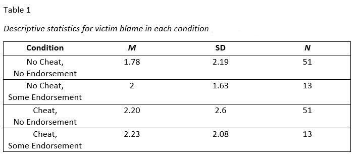
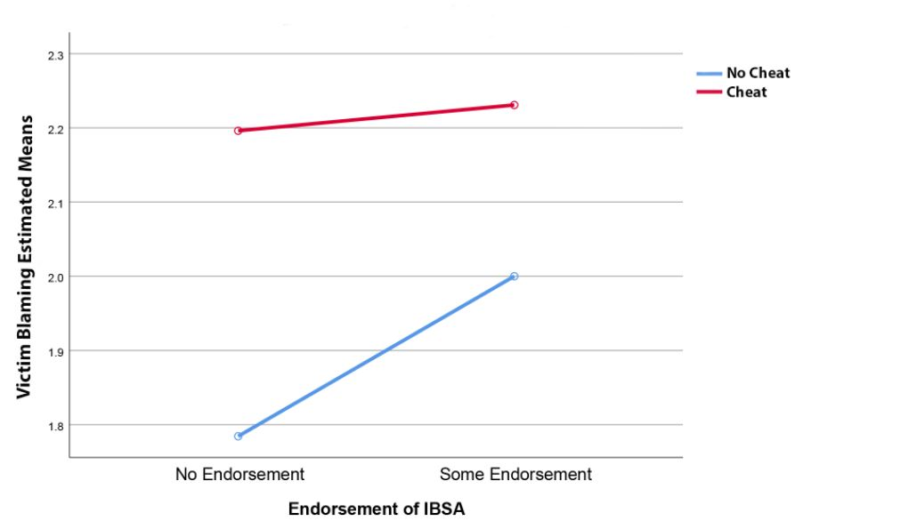

# The effects of proclivity to image-based sexual abuse and cheating behavior on victim blaming 
&nbsp;
#### **INTRODUCTION**
The purpose of this study was to determine if participants with proclivity to image-based sexual abuse (IBSA) and cheating behaviour would increase victim blaming, which might help understand the widely held belief in our society that victims share a big part of the blame in the case of nude leaks and sexual abuse.

&nbsp;
***
#### **DESIGN**

A mixed experiment consisted of two independent variables, each with two levels: the between subjects variable (IBSA proclivity) had ‘some endorsement’ and ‘no endorsement’ levels, while the within subjects variable (Victim cheat) had ‘no cheat’ and ‘cheat’ levels. The dependent variable was victim blaming, measured on a Likert scale (0-10). The experiment was conducted using an online survey software.
&nbsp;
Using the online survey, participants had to read a scenario presenting an IBSA case and rate the blame of the victim for the situation (the word ‘victim’ was not used in the question but the name of the actual character in order not to influence participant’s judgement) on a Likert Scale (0-10). Furthermore, participants were asked to rate the victim blame for the situation again, however this time they had to imagine from the scenario they read that the new relationship the victim had commenced before the break-up of the existing one (i.e. cheating). Finally, participants had to complete the Revenge Porn Proclivity Scale.

&nbsp;
***
#### **RESULTS**
The descriptive statistics for victim blame in each condition are shown in Table 1.

&nbsp;

Data was analyzed using a mixed measure ANOVA. There was no significant main effect of endorsement F(1, 62) = .03, p = .84, η² = .001. Similarly, there was also no effect of cheating F(1, 62) = .91, p = .34, η² = .015. There was a non-significant two-way interaction of endorsement to IBSA and cheating F(1, 62) = .07, p = .78, η² = .001.
&nbsp;
&nbsp;

&nbsp;
***
#### **Conclusion**
This current study set out to examine whether IBSA endorsement and cheating behavior manipulations would result in changes in victim blaming. The findings showed some mean differences between the groups, as the ‘cheat’ conditions had higher victim blame scores than the ‘no cheat conditions’, as well as the ‘no endorsement’ having lower victim blaming scores than their ‘endorsement’ counterparts. However, no results were significant, thus not supporting any of the hypotheses. 
