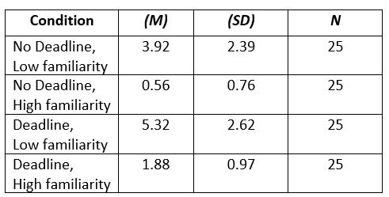
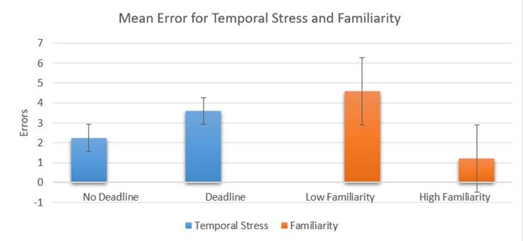

# The effects of temporal stress and familiarity on number of errors made in a naming task 
&nbsp;
#### **INTRODUCTION**
The purpose of this study was to determine if temporal stress and familiarity would increase errors in healthy participants, which might help future imaging studies to have a baseline between aphasic and healthy participants. 
&nbsp;
This is done due to the need to see the effects of aphasia treatment on aphasic patients compared to healthy subjects. However, this is hard to be done at the moment because there is a big disparity between these 2 groups and thus hard to estimate the effectiveness of the treatment.
&nbsp;
Therefore, this current study hypothesizes that temporal stress will significantly influence the number of errors made by participants, while familiarity will also significantly influence the number of errors made. Finally, it is hypothesized that there will be an interaction between temporal stress and familiarity for naming errors.

&nbsp;
***
#### **DESIGN**
The within subject experiment consisted of two independent variables, each with two levels: **temporal stress** (No deadline and Deadline) and **familiarity** (High familiarity and Low familiarity). The dependent variable was the number of errors made by the participant on the naming task. 

The experiment was designed as a two block of 40 black and white line drawings, 20 images represented high familiarity stimuli and 20 represented low familiarity stimuli, presented every 6 second. 
In the slow block the images were presented for 5 seconds with a fixation cross of 1 second from when picture was removed. In the fast block the images were presented for 600 milliseconds, followed by a buzzer that lasted 600 milliseconds and a fixation cross showed for 5400 milliseconds from when the picture was removed.
 The temporal stress was counterbalanced between participants so half of them had to go through the ‘No Deadline’ condition first, while the other half started with the ‘Deadline’ condition first.
&nbsp;
***
#### **RESULTS**
The mean numbers of errors in each condition is shown in Table 1.

_Table 1_ Descriptive statistics for error scores.

Data was analysed using a two-way repeated measure ANOVA. There was a significant main effect of temporal stress F(1, 24) = 18.57, p < 0.01, η2p = 0.43. There were less errors when there was no deadline than when there was a deadline (See Figure 1). Also, there was a significant effect of familiarity F(1, 24) = 71.50, p < 0.01, η2p = 0.79. There were more errors made when stimuli presented low familiarity than high familiarity (See Figure 1). However, there was a non-significant two-way interaction of temporal stress and familiarity, F(1, 24) = 0.015, p = .905, η2 = .001 .

_Figure 1_ Mean Error for temporal stress and familiarity

***
#### **Conclusion**
This current study set out to examine whether temporal stress and familiarity manipulation would result in an increase in the errors made by healthy participants in a naming task. **Findings supported two of the three hypothesis** by observing that there was a **significant effect of temporal stress**, suggesting that participants who had to name the stimuli while having a deadline would produce more errors than when there was no deadline. 

Similarly, **familiarity also played a significant role in the numbers of errors made**, as there were more errors made when the stimuli presented were of low familiarity. **However, there was no interaction present**, suggesting that the effects of temporal stress did not depend on the level of familiarity, and vice versa. 
