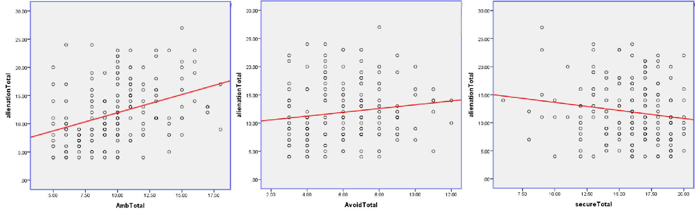
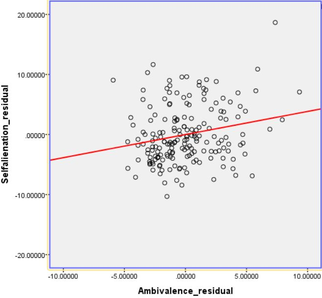

# Investigating the relationship between attachment styles and self-alienation
&nbsp;
#### **INTRODUCTION**

This study looked at the relationships between the 3 attachment styles (secure, avoidant and ambivalent) and self-alienation while taking into account the effects of self-liking and emotional stability.

Alienation, as shown by past researches, is related to Post Traumatic Stress Disorder (PTSD) and it significantly predicted the severity of PTSD. Moreover, found that self-alienated adolescents were more likely to report low self-esteem and general hopelessness about future. Although there have been past researches that looked at the relationship between self-alienation and different characteristics of a person, there has not been many evidence about the relationship between self-alienation and attachment style, which are prevalent concepts related to every single person.
Moreover, this study will also take into consideration the effects of self-esteem and emotional stability. This consideration is due to previous findings which found a significant correlation between authenticity and emotional stability even though it only accounted for a small percent of the variation. The same was true for the correlation between authenticity and self-esteem.

Therefore, it is hypothesized that secure attachment will negatively correlate with self-alienation, while avoidant and ambivalent attachment styles will positively correlate with self-alienation. 
It is also predicted that after partialling out the effects of self-liking, attachment ambivalence and avoidance will positively correlate with self-alienation, while attachment security will negatively correlate with self-alienation. 
Finally, it is hypothesized that after taking the effects of self-esteem and emotional stability into consideration, the 3 attachment styles will make a significant contribution in predicting self-alienation and all 3 attachment styles will individually be a good predictor of self-alienation.
&nbsp;
***
#### **DESIGN**
The participants were required to complete an online questionnaire comprised of multiple scales.
The materials used were the 12 item ‘’Authenticity scale’’, the 14 item ‘’Measure of Attachment Qualities’’, the two dimensional ‘’Self-Liking/Self- Competence’’ scale which measured self-esteem and 4 items from the ‘’Ten-item Personality inventory’’ which measured the ‘’Big-Five’’ personality traits of ‘’Agreeableness’’ and ‘’Emotional Stability’’. 

All materials previously mentioned were embedded in one online questionnaire. Using the Likert Scale participants ranked their level of agreeableness. The scale for Authenticity started from 1 to 7, where 1 is “Does not describe me at all”, 2 is “Does not describe me”, 3 is “Sometimes but in infrequently describes me”, 4 is “Occasionally describes me”, 5 is “Often describes me”, 6 is “Describes me”, 7 is “Describes me very well”. 

The aim of the study was to look at the relationship between the predictor variables; secure, avoidant and ambivalent attachment and the outcome variable of self-alienation and authenticity levels, whilst measuring the effects of self-esteem and emotional stability. The same non-experimental procedure was carried out amongst all participants in which they completed the same questionnaire online.
&nbsp;
***
#### **RESULTS**

A Pearson correlation coefficient analysis was conducted to investigate whether there was a correlation between self-alienation and the three attachment styles. The results indicated that there was a significant positive correlation between ambivalence (M = 9.98, SD = 3.06) and self-alienation r (183) = 0.374, p<.001. 
Similarly, the analysis found a positive significant correlation between avoidance  (M=6.11, SD=2.14) and self-alienation r (183) = 0.136, p<.05. This demonstrates as the self-alienation score increase, the avoidance and ambivalence score simultaneously increase.
However, the result showed a negative significant correlation between the secure attachment type (M= 18.19, SD=2.92) and self-alienation r (183) = -0.154, p<.05. This indicates, when scores on secure attachment increased, the scores on self-alienation consequently decreased.

_Figure 1_ Scatter Plot correlation between self-alientation and the 3 attachment styles

A partial correlation was run to determine the relationship between self-alienation and the three attachment styles whilst controlling for self-liking. There was a negative correlation between self-alienation and the secure attachment whilst controlling for self-liking but it was statistically not significant, r = -.101, p = .176. Similarly, the positive correlation between self-alienation and avoidant attachment whilst controlling for self-liking was statistically non-significant r = 0.093, p = .21. However, the positive correlation between self-alienation and the ambivalent attachment style was statistically significant r = .217, p < .05 .

_Figure 2_ Scatter Plot correlation between self-alientation and the ambivalent attachment style whilst controlling for self-liking

A multiple regression was carried out to investigate whether the three attachment styles were a significant predictor of self-alienation, after taking emotional stability and self-liking into consideration. The results of the regression indicated that model 1, of emotional stability and self-liking, explained 25% of the variance rates in the alienation scores. The model showed that the accountability of variance for self-liking and emotional stability scores, were significant predictors, F (2,180) =30.39, p<.001. The second model shows statistically significance, F (5,177) = 14.55, p<.001, and accounts for 29% of the variance. The r squared change was statistically significant, F (3,117) =3.24, p<0.05.
Additionally, inspection of the beta weights demonstrated that ambivalent attachment (Beta= 0.174, t=2.378, p< 0.05), self-liking, (Beta = -0.171, t=2.143, p<0.05), emotional stability (Beta = -0.302, t= -4.040, p<0.01) significantly contributed towards the model. On the other hand, secure attachment (Beta=-0.066, t= -0.837, p=0.404) and avoidant attachment (Beta=0.065, t=0.817, p=0.415) are statistically insignificant and consequently do not contribute towards the model. 

Therefore, this indicates that attachment styles are a good predictor of self-alienation, as the model of attachment styles could account for variance in alienation score even after taking into account the self-liking and emotional stability. However, amongst the 3 attachment styles, only the ambivalent attachemnt style significantly contributed to the model.

***
#### **Conclusion**
According to the expectations, secure attachment style was negatively correlated to self-alienation, while ambivalent and avoidant were positively correlated. However, once self-liking was partialled out, secure and avoidant styles become non-significantly correlated to self-alienation. 
Finally, creating a model that investigates this regression while partialling out effects of self-liking and emotional stability illustrated the final hypothesis. This model showed that while partialling out for the already mentioned effects, the attachment styles could significantly account for the variability in self-alienation. However, while looking closer to the variables of this model, it was observed that only ambivalence held a significance. Therefore, indicating the positive relationship between self-alienation and the ambivalent attachment style.
