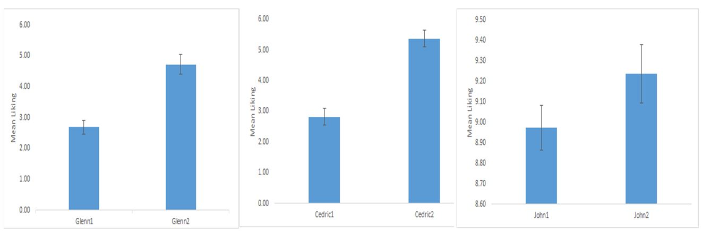

# Familiarity and gender differences in liking of unisex names
&nbsp;
#### **INTRODUCTION**
Familiarity means to have a close acquaintance with something and, as it is widely believed, this can determine how much a person likes a certain stimuli, meaning that we are more attracted to something that is familiar.
In addition, Little, DeBruine and Jones (2014) showed in a number of studies another detail regarding familiarity and liking but from a gender perspective. Little et al. (2014) exposed individuals to faces twice and found that liking increased overall the second time, reflecting attraction to familiar faces. However, the difference was that men’s ratings of female faces decreased on the second rating, demonstrating attraction to novelty. Little et al. (2014) explained that this attraction to novelty in men may reflect an adaption promoting the acquisition of a high number of sexual partners. 
This study aims at examining the change in liking for forenames as a result of increased familiarity with them and to observe whether there were gender differences in liking for a unisex name after becoming more familiar with it

&nbsp;
***
#### **DESIGN**
A group of English Literature students had to rate their degree of familiarity with 12 forenames at the beginning and end of a semester. The dependent variables were the degree of liking for the forenames and the familiarity ratings, measured using a 0-10 scale before and after becoming familiar (0 = dislike strongly and 10 = very familiar; 0 = not at all familiar and 10 = very familiar). The independent variable for the first hypothesis was familiarity with the forenames, which was induced by having all the participants read a book, a classic 19th century story about three characters called Glenn, Cedric and John. The second hypothesis had two independent variables, familiarity with the unisex forename (i.e. Glenn) and gender.
A repeated measures design was used to manipulate the time of testing for the degrees of liking, which represents the interval in which participants became familiar with the names (before and after reading the book).  

&nbsp;
***
#### **RESULTS**
Paired samples t-test revealed that the degree of liking for the forename ‘Glenn’ was significantly increased (See Figure 1) after reading the book (M = 4.71, SD = 1.97, SE = .32) than it was before reading the book (M = 2.68, SD = 1.31, SE = .21), t(37) = 5.36, p < .01, Cohen’s d = 0.87 . 

The same applies for the forename ‘Cedric’, which showed a significantly increased degree of liking after reading the book (M = 5.37 , SD = 1.65, SE = .26) than before reading it (M = 2.82 , SD = 1.69, SE = .27), t(37) = 6.26, p < .01, Cohen’s d = 1.01. 

The forename ‘John’ was different than the other two because the degree of liking showed no significant increase after reading the book (M = 9.24, SD = .88, SE = .14) compared to before reading it (M = 8.97, SD = .67, SE = .11), t(37) = 1.82, p = .07, Cohen’s d = 0.3 

_Figure 1_ Liking means for the forenames before and after becoming familiar with them

There was a significant difference between girls (NoChange = 5, Change = 14) and boys (NoChange = 14, Change = 5) regarding the change in liking for the unisex forename ‘Glenn’ as a result of reading the book: X2(1, N = 38) = 8.52, p < .05 . This indicates that females seemed to like more the forename ‘Glenn’ after reading the book than males, who predominantly showed no change in liking after reading the book. 

***
#### **Conclusion**
This study observed whether the degree of liking for a stimuli which can be controlled (i.e. forenames) changed as a result of increased familiarity. Moreover, the study investigated if there are gender differences based on familiarity regarding liking of a unisex forename (i.e. Glenn).

Firstly, the results showed a significant increase in liking as a result of familiarity for the forenames ‘Glenn’ and ‘Cedric’ but not a significant one for the forename ‘John’. 
The only exception which does not support the first hypotheses which states that the degree of liking for names changes after the individuals become more familiar with them is the absence of change in liking for the forename ‘John’. This exception may be as a result of the popularity that this forename has nowadays, which means that the absence of change might be because the participants were already familiar with the name without having to read the book.

Secondly, a significant difference between girls and boys regarding liking for the unisex forename was observed. More specific, females seemed to like more the forename ‘Glenn’ after reading the book than males, who predominantly showed no change in liking after reading the book. These results are similar to those of Little et al. (2014) highlighting the fact that men are more attracted to novelty than familiarity. An explanation for these findings might be than even though the forename was unisex, it could still have been perceived as a female forename and this could have affected the preference of men after becoming familiar with it. As stated by Little et al. (2014), men’s attraction to novelty may reflect an adaptation promoting the acquisition of a high number of sexual partners, meaning that this attraction could apply only regarding female aspects, such as faces, or in this study, forenames. 