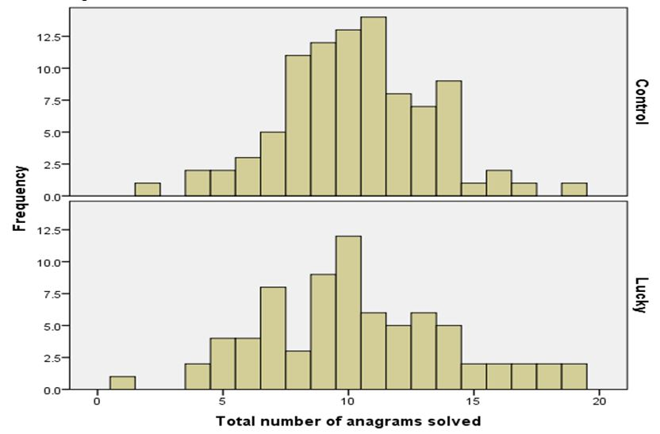

# Superstition and Performance on Different Tasks
&nbsp;
#### **INTRODUCTION**
Luck has been widely perceived by most of us as an important factor in determining a person’s performance and it is widely regarded in our society as a significant trait for success. Some studies looked into this belief from a scientific perspective and have shown that if a person is feeling lucky because of a certain encouragement or lucky charm their performance to certain tasks increases (Damisch, Stoberock & Mussweiler, 2010). However, the conclusions of these studies could be attributed to the possibility that superstition influences performance only on specific tasks. Aruguete, Goodboy, Jenkins, Mansson, and McCutcheon (2012) demonstrated that superstitions related to prayers do no change a person’s performance on a reasoning test. 

The present research looked at whether or not evoking lucky superstitious beliefs influence performance on an anagram task by looking at two different groups: the “lucky” group and the control group. Another observation made by this research was regarding the performance on the anagram task within the lucky group considering how strongly people believe in luck and how lucky one sees themselves. The first hypothesis is that if luck plays an important role in one’s performance then the lucky symbols given to one of the groups should influence their performance on the anagram task compared to the control group. Secondly, performance on the anagram task within the lucky group should be influenced by how strongly people believe in luck and how lucky they see themselves.

&nbsp;
***
#### **DESIGN**
The experiment examined the influence of luck on performance to a certain task (i.e. solving anagrams) and was realized as a between-subjects design. The independent variable was lucky superstitious beliefs and consisted of an encouragement written on the paper: “I’ll keep my fingers crossed for you”, and some symbols considered lucky (i.e. a four leaf clover, a horseshoe). The participants were randomly split into two groups that had the exact same anagram and available time, the only difference being the “lucky” symbols given to only one of the groups on their paper. The dependent variable was each group’s performance, measured in the amount of correct answers. 

The second task for all the participants consisted in completing a “Beliefs Around Luck” scale by Darke and Freedman which assessed their superstitious belief about luck and how lucky they see themselves. The BAL (beliefs around luck) scale which was divided into two BAL sub-scale score: BIBL (Belief in being lucky) and Genluck (General luck). 
&nbsp;
***
#### **RESULTS**
Figure 1 shows the number of anagrams solved by participants from the two groups, the group that received a lucky charm on their test and the group that did not receive any lucky charm.

_Figure 1_ Total number of anagrams solved 

An independent samples t-test shows that there was no difference between the 2 groups: t(138.32) = -.108, p = .91. Therefore, indicating that the lucky charm did not have any effect on the number of anagrams solved.

The range for BIBL was from a minimum of 6 to a maximum of 30 (M = 17.71,SD = 4.969) while the range for Genluck was 6 to 32 (M = 20.34, SD = 5.870). 
Correlation between BIBL with the number of anagrams solved showed for the control group non-significant results, r = -.024, N = 82, p = .832, just as it showed for the lucky group,  r = -.076, N = 64, p = .552. 
Correlation between Genluck and total number of anagrams solved showed as well non-significant results both for the control group, r = -.023, N = 83, p = .480, and for the lucky group, r = -.089, N = 65,  p = .480.

***
#### **Conclusion**
This experiment assessed the hypothesis that evoking lucky superstitions beliefs influences performance in an anagram task but the findings could not support this statement, as the control and lucky group performed similarly in the task. Moreover, there is no clear correlation between the number of anagrams solved and the belief in luck or how lucky someone sees themselves. Therefore, this indicates that luck does not seem to play any role in how proficient one is at a logical task such as solving anagrams.